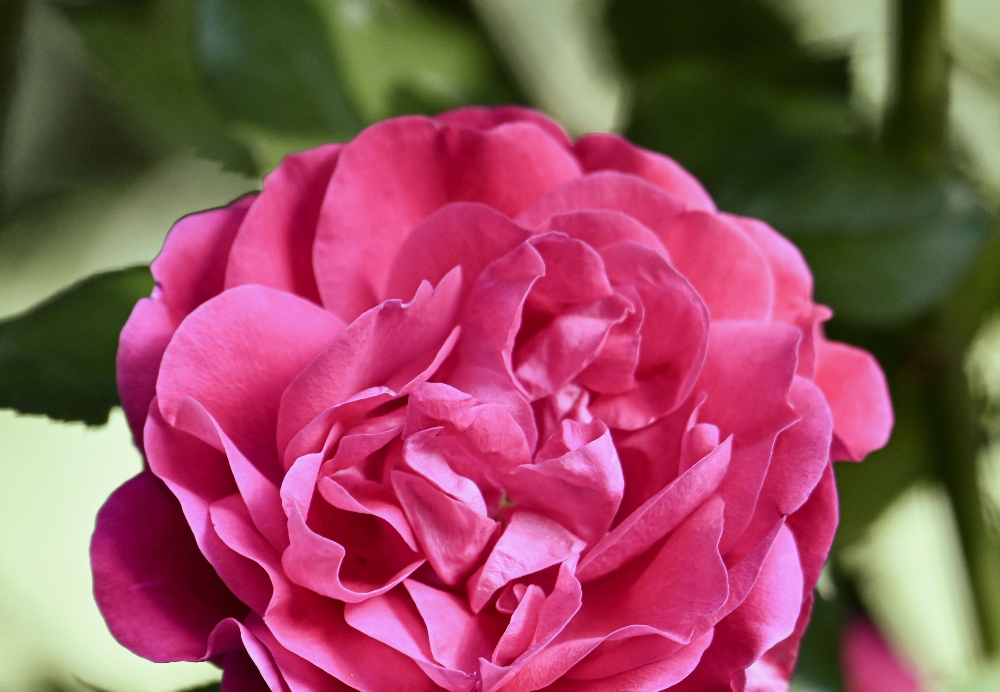
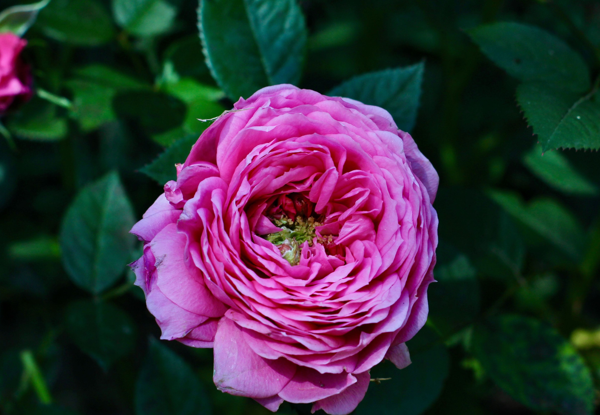
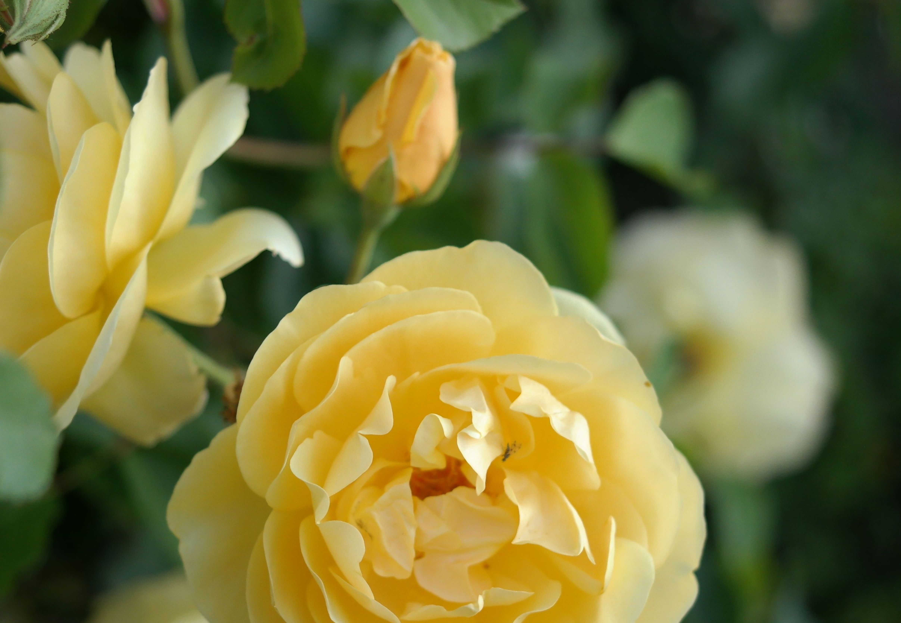
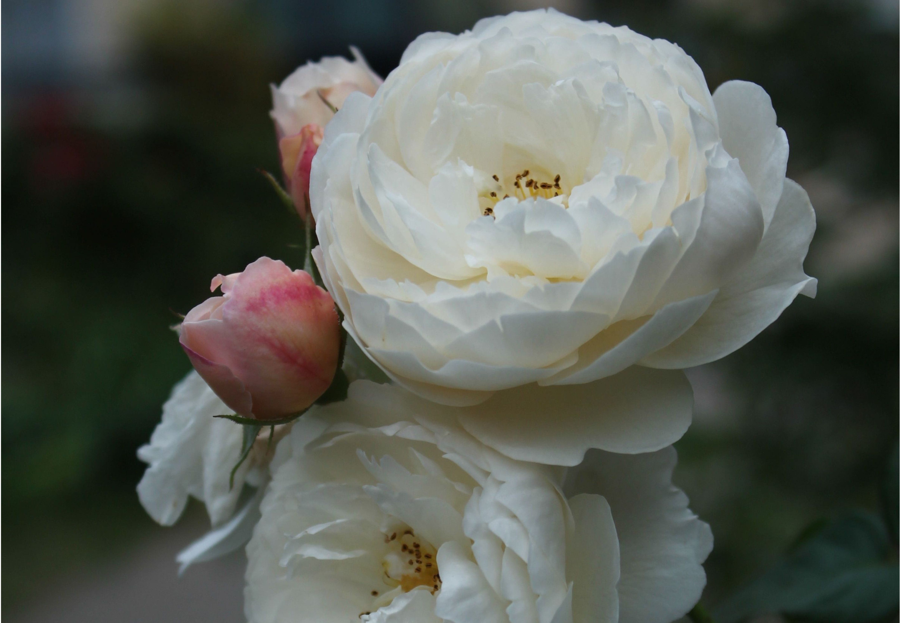

# 🌹 Taif Rose Image Classification System

An end-to-end computer vision project developed to classify the authentic Taif Rose against the commercial Damask Rose using deep learning.

---

## 🎯 Project Inspiration

* 🌐 **Global Heritage:** Taif is renowned as the "City of Roses," cultivating over 900 million roses annually in a unique high-altitude climate.
* 🌿 **Botanical Clones:** Both flowers share the Rosaceae family, making the Taif rose a specific cultivar of the Damask rose.
* 🔍 **The Visual Challenge:** Due to their close genetic and visual similarities, distinguishing between them remains a complex task.
* 🤖 **AI-Powered Solution:** This project leverages Computer Vision to identify and precisely differentiate our city's heritage from the Damask variant.
* 🛡️ **Preserving Authenticity:** By capturing subtle nuances in petal structures, this work uses AI innovation to safeguard regional national assets.

---

## 🛠️ Tech Stack & Frameworks
* **Language:** Python
* **Environment:** Google Colab / Jupyter Notebook
* **Deep Learning Framework:** Keras & TensorFlow
* **Computer Vision Library:** Pillow (PIL) & NumPy
* **Core Architecture:** MobileNet / Convolutional Neural Networks (CNN)

---

## ⚡ Quick Steps
<kbd>Step 1</kbd> **Dataset Preparation:** Collected and cropped high-resolution images to a uniform square size of $224 \times 224$ pixels.
<kbd>Step 2</kbd> **Model Training:** Employed Transfer Learning via Teachable Machine using a pre-trained CNN.
<kbd>Step 3</kbd> **Deployment & Inference:** Exported the `.h5` model weights and implemented a Python script for testing.

---

## 📸 Training Dataset Sample

Using a representative dataset of curated images, perfectly balanced for accurate deep learning training.

### Class 1: Taif Rose (Light pink, delicate)

  
  
  

### Class 2: Damask Rose (Deep red, structured)

  
  
  

> 💡 *Note: All training images were automatically normalized and resized to $224 \times 224$ pixels before the matrix training stage.*

---

## 🏆 Final Evaluation & Results

## 🚀 Try It Live
Click the badge below to run and test the interactive code directly inside your browser:

